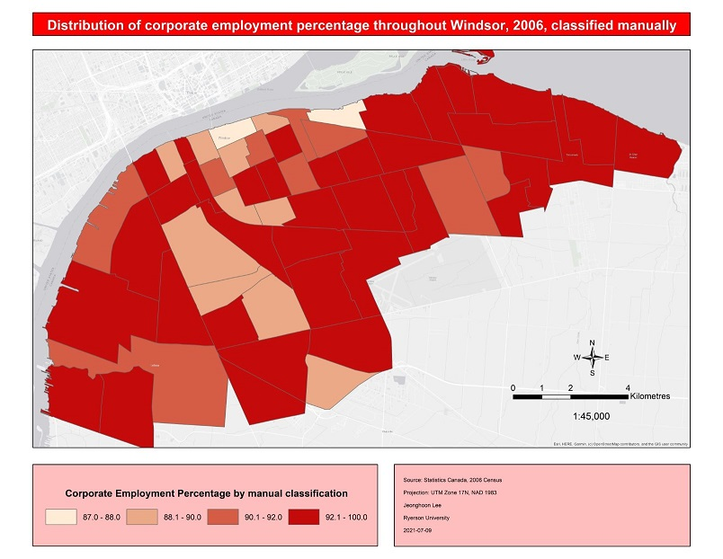
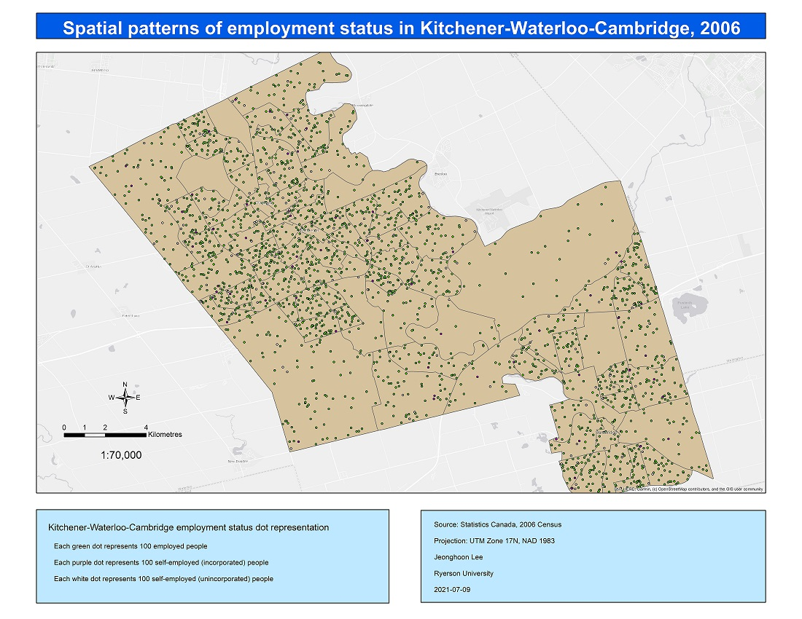

The courses have finally come to a close. The exams were straight forward and relatively simple. I suppose this is because the purpose of the exams was to reinforce the concepts and techniques of GIS, values that we learned each week through the map products we had created.

I still have questions regarding principles that are just ripe for debate. What is the proper balance between user functionality and map customization. Where does the future of GIS lie: in fluid or static maps?

A map product must be simple in its purpose. Every time I look at a map, I want to get my primary source of information within two to three seconds. All other information must be 50% in the background. This is an important aspect to user functionality. However, I also believe that map customization is important to cartography. The map user must be able to dictate what sort of information they can glean from the map. Traditional, physical maps are the worst at this. Well-made physical maps efficiently convey cartographic information to its user, but they remain static and unchangeable. Virtual maps suffer from the opposite problem. With virtual maps, users are introduced to a plethora of information categorized into various layers. It is not until the map user siphons out the excess information and configures the map to their requirements that the map becomes simpler to understand. Google Maps is a prime example of this: the map quite literally shows you everything that it is permitted to show until you search for a specific location or ask for directions.

This begs the question: what kind of maps are best suited for the future? Will people benefit more from fluid maps, or will static maps reign supreme. The answer to this is not so simple (and it doesn't actually require an answer, but I still want to discuss it). Despite what I said earlier, I believe that fluid maps will become more and more utilized. The potential for fluid maps far surpass that of static maps. More information can be found within fluid maps. However, focus must be placed on making the UX/UI of fluid maps simple and intuitive so that users can still receive the primary information within just a couple of seconds.