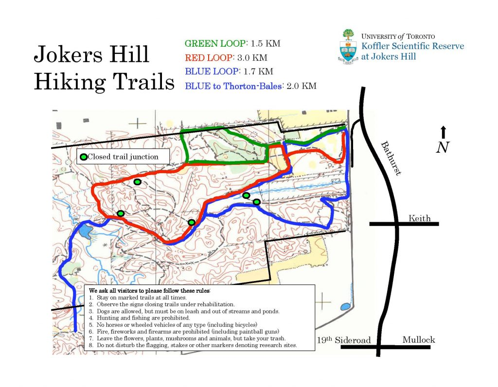
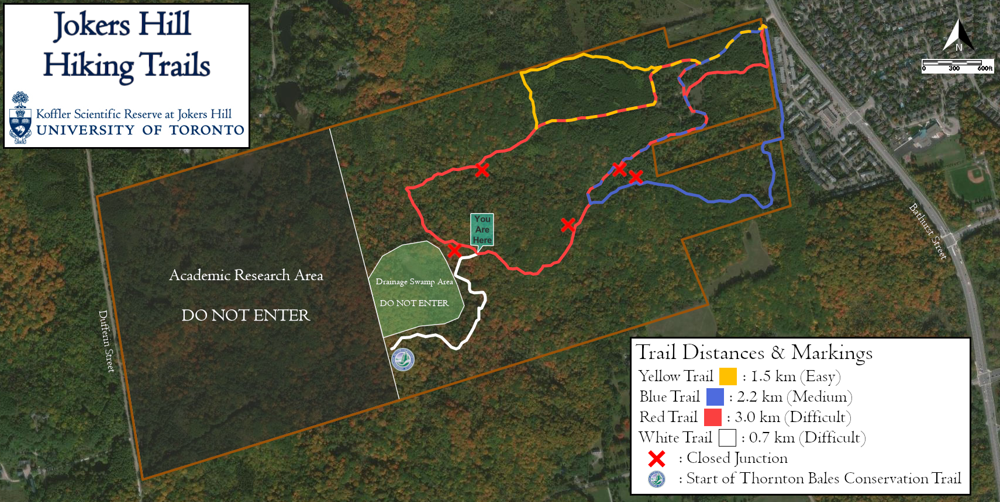

Late last year, I had the opportunity to visit University of Toronto's Koffler Scientific Reserve and make a map of their hiking trails for them. Due to logistical reasons, the revised version of my map was never produced. But I thought it still worthwhile to put it here in order to show what could have been.

This first map is the one that can be found on their website right now. Here is the link to their website: https://ksr.utoronto.ca/hiking-trails/

This second map is my own version, created by geologging the trails using the myTracks app on the Apple store and editing the picture using GIMP. I incoporated UofT's font styles and colour schemes to the map. Thoretically, there would be many versions of this map, with the "You Are Here" markers in different locations depending on the final location of the respective map.

