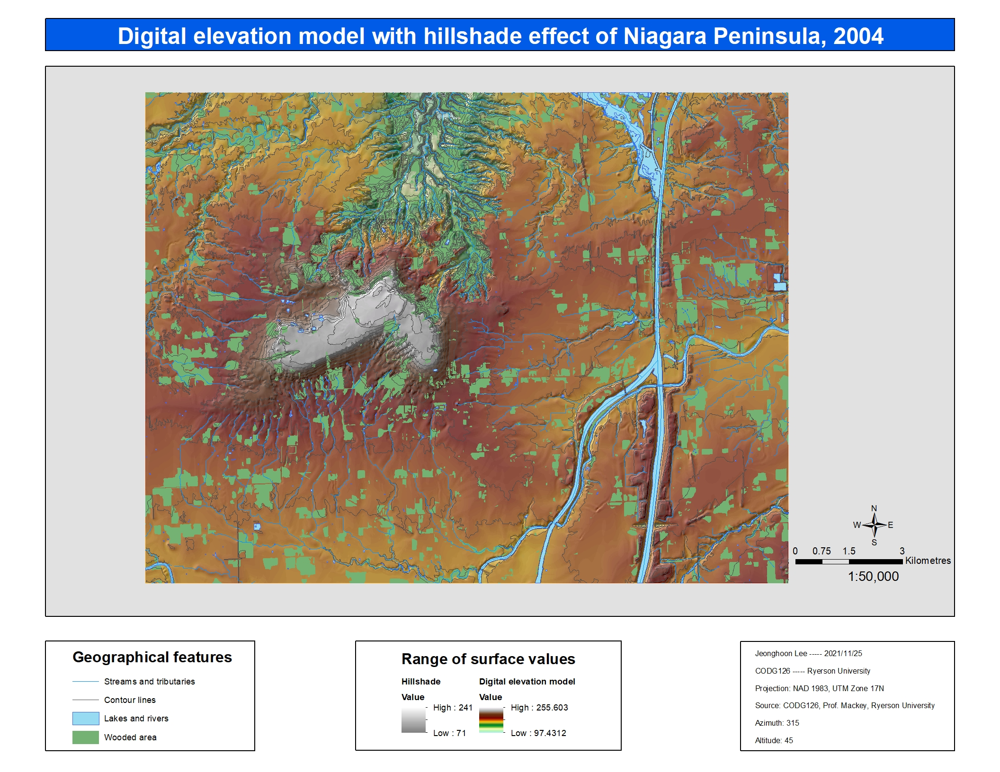
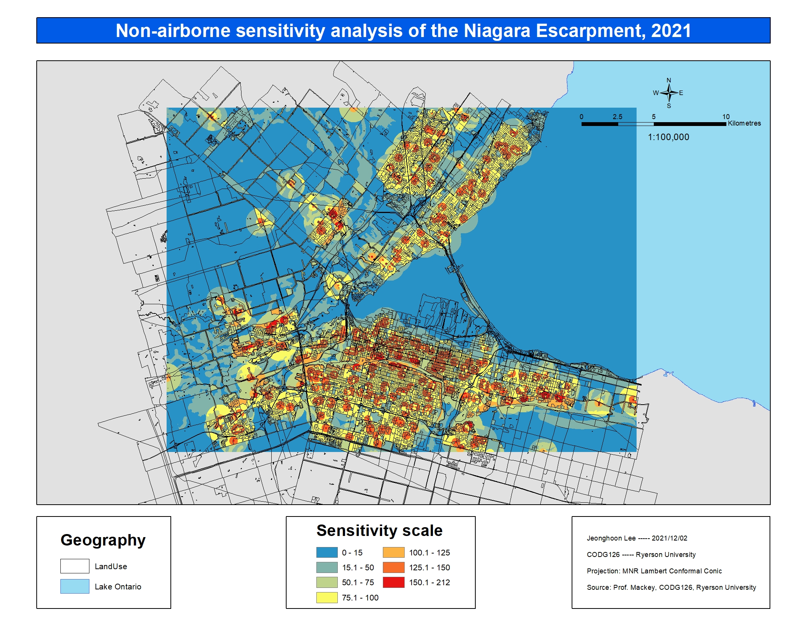
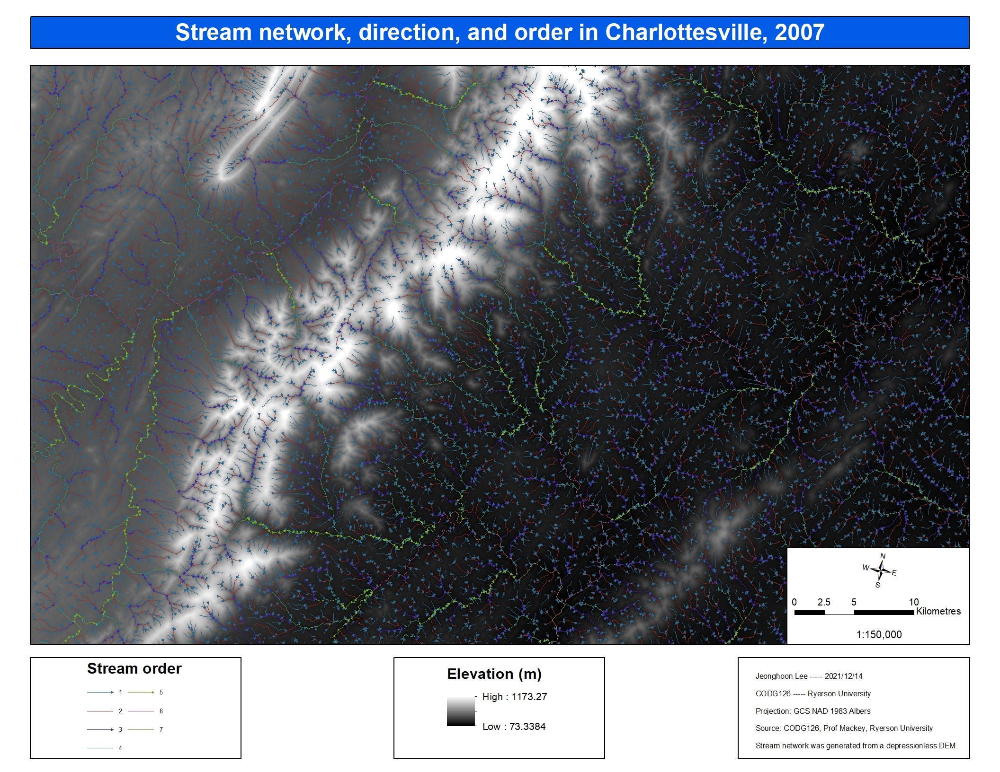
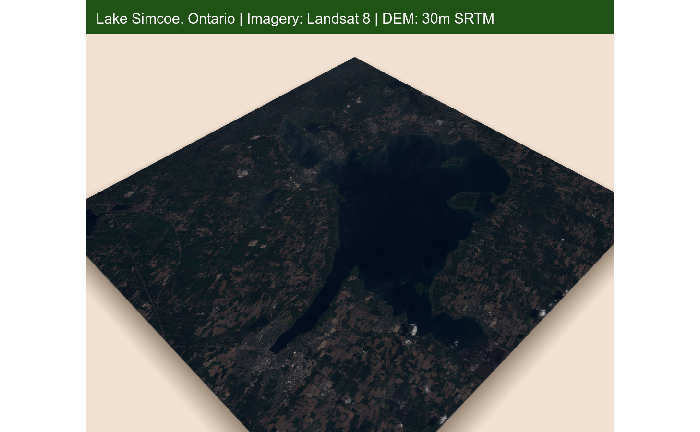

Welcome to the seventh episode in my GIS journey. This next course that I'll be discussing taught me effective use of GIS in environmental management. The class started off with a review in the principles of environmental management: land use, environmental assessment, modeling, compliance, etc. Going through the lab assignments, I kept on getting surprised with the applicability of GIS in many environmental issues. Need to model air plumes through the atmosphere? No problem. There are multiple atmospheric modeling equations available in the software. Need to track compliance of factories with today's standards? No problem. As long as you have a modicum of SQL knowledge, the solution is easily attainable in just a couple of minutes. The most interesting topic covered by the class was disaster management. The techniques employed by emergency services all require extensive GIS use.

Below are some of my maps that I had to produce for the course. Most of them, if not all, were made using ArcMap. I am trying to migrate towards ArcGIS Pro. I feel like ArcMap's interface is stuck in 2008, while ArcGIS Pro feels much more modern. Trying to run geoprocessing tools in ArcMap is especially bad and antiquated. The geoprocessing interface in ArcGIS Pro gives much more information in terms of output and error reports. Don't even get me started on the Python integration! ArcGIS Pro seems to have been developed with Python customization much more in mind.

I wish that I had the opportunity to study more in-depth into the statistical modeling in this class. I understand that the professor had to cover a broad range of topics more relevant to the environment. However, I was interested in modeling equations, especially in the data interpolation problems. This issue was definitely more apparent in the final course that I took this semester: GIS and map algebra. I will be covering this class in the next episode so stay tuned!

