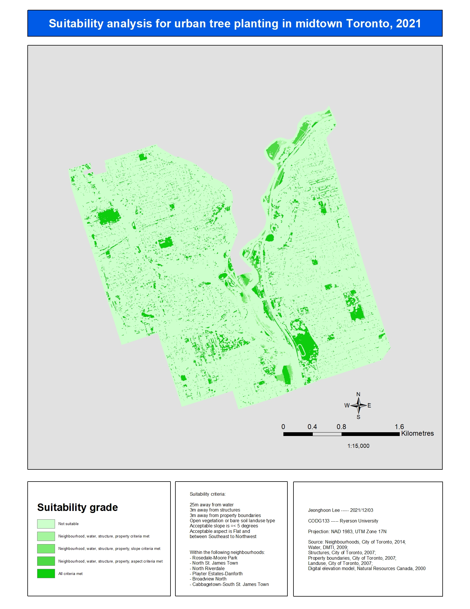

Here is the eighth episode of my GIS coursework. This GIS course introduced to me the concept of map algebra and how to conduct map overlay. The primary concepts that the professor taught us were rasterization of vector files, reclassification of newly created raster files, and combination of multiple raster files to a finalized map product. These mapping principles were fairly easy to grasp. I had a lot of fun logically figuring out how to reclassify raster files. Which characteristics should be prioritized according to the pre-requisites? The combination of these raster files were also challenging again in terms of prioritization. Which characteristics should take precedence?

The lab assignments were fairly challenging. It took material from the relevant lectures and workshops and gave us free roam to tackle the core problem. The lab worksheet guided us through the problem but the end product was open-ended, requiring us to justify our map using logic. Suffice it to say, I enjoyed the labs and found them stimulating. Below are my maps from the two lab projects.

The constraint mapping techniques were enjoyable; however, I was more intrigued with the latter half of the class. Near the end of the course, the professor began to teach us spatial statistical methods. She taught us geographic weighted regression analyses and various local indicators of spatial autocorrelation. Unfortunately, this was just a brief introduction. I wanted to learn more about these spatial statistical methods. Thus, I decided to take a course dedicated to such methods for my final course required to complete my certification.

I am now currently undertaking this spatial statistics course. So, episodes of "Adventures in GIS" will temporarily be halted. The good news is that I have also just started messing around with Amazon Web Services (AWS). AWS is a cloud computing service that allows customers to use virtual computing software to fulfill hardware/software needs. It's quite astounding how far cloud computing technology has come in the last few years. I am thinking of studying for the AWS Architect and Developer certification exams. I will try to keep this website updated on that front.