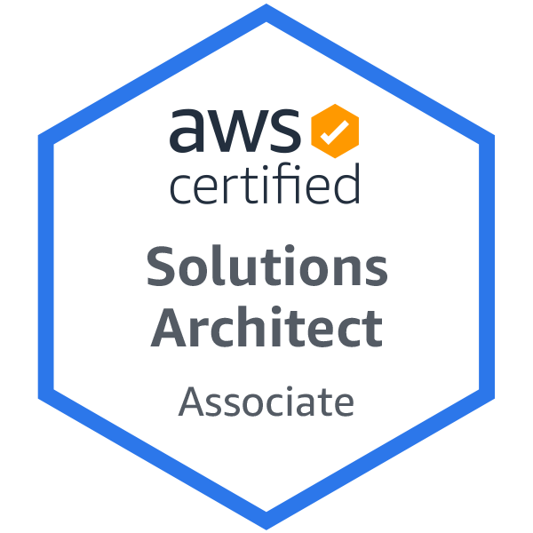

I'm pleased to announce that I was able to pass the AWS exam and have earned the AWS Solutions Architect - Associate certification. I learned a lot about the various AWS microservices during my studies and am excited that I now have something to show for it. Of course, I know that my journey does not stop here. I still have a long ways to go in terms of getting a job in this field. The most common advice that I've received regarding finding employment is to build up a portfolio of projects that showcase relevant skills. I think that I have a good base with my website. I can use my blog here to present projects that I've completed and to announce projects that I'll be working on. Currently, I have projects based on R and Python. I definitely will be working on assignments that show off my AWS skills. I'm excited with this new achievement and for the opportunities that this certification will provide.

You can check out the badge here: https://www.credly.com/badges/737ad05d-0c04-4886-9e8f-6d3bed68dac3/public_url

