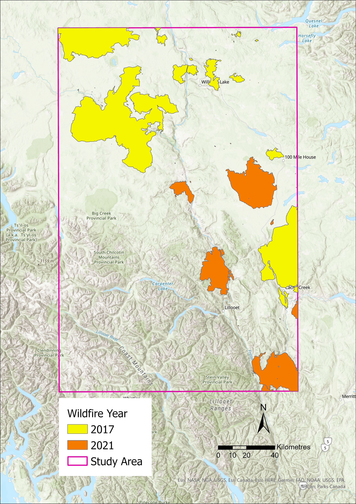
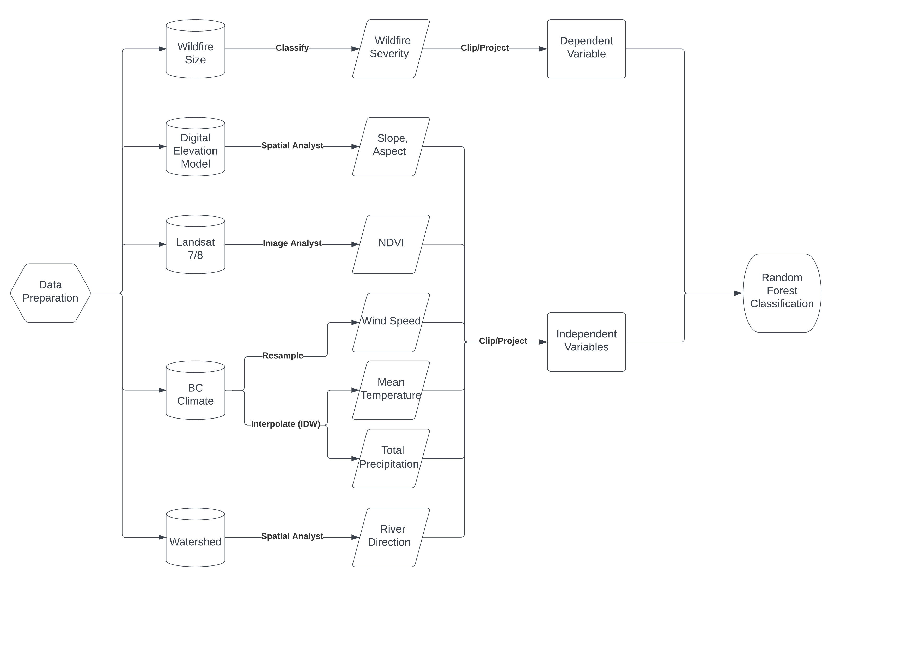
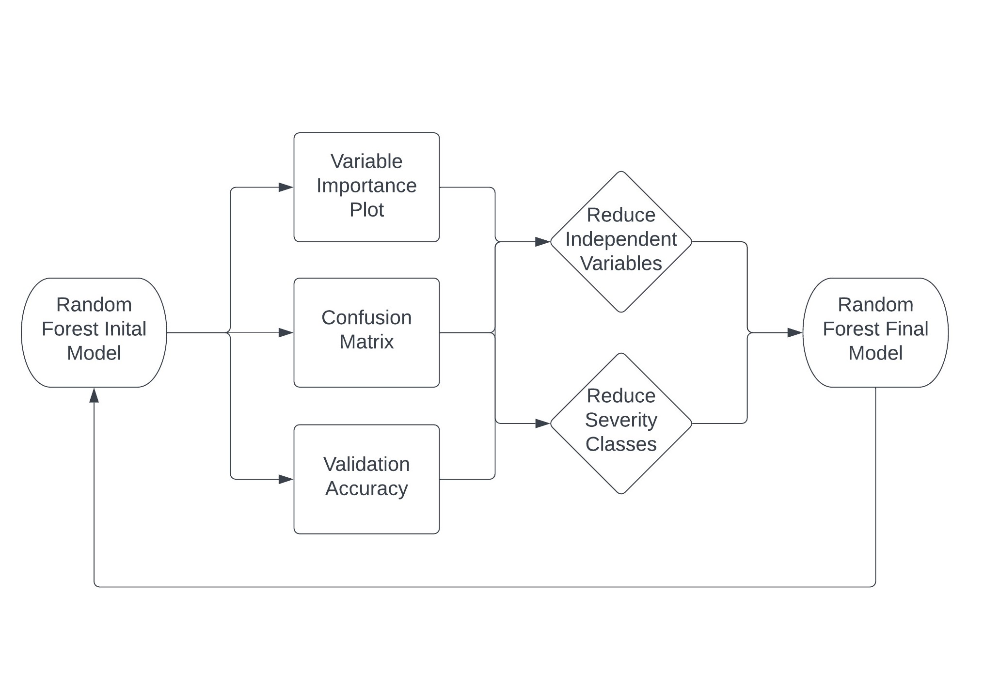
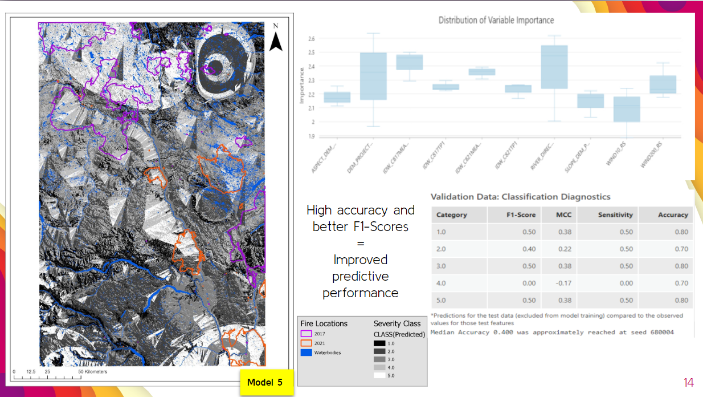

So, the certificate program has come to a close. I completed my final project for my final course: a group presentation for CODG212. Our group was tasked with predicting wildfires. We looked into creating a random forest model to predict wildfire severity in central interior British Columbia.

Random forest analysis is a machine learning algorithm developed by Leo Breiman and Adele Cutler that aggregates the outputs of multiple decision trees to reach an ultimate result. Decision trees consist of decision nodes, leaf nodes, and root nodes. A decision tree algorithm divides a training dataset into branching paths. This sequence continues until a leaf node is attained.

Our wildlife severity variable was fabricated from wildfire size data. Wildfires were classified into categories based on their sizes in hectares. Larger fires would be deem more severe than smaller ones. We had multiple explanatory variables: elevation, slope, aspect, normalized difference vegetation index (NDVI), wind speed, mean temperature, total precipitation, and river direction. After painstaking amounts of data cleanup, we were able to input these variables into a random forest analysis to output a predictive raster model.

Using variable importance plots, confusion matrices, and subjective observations regarding the model outputs, decisions were made concerning which explanatory variables should be eliminated. Most notably, NDVI produced the most amount of noise for our dataset. Therefore, we eliminated the NDVI variable and ran the random forest model a couple more times. River distance and elevation seemed to be particularly important to the model. Reducing the number of wildfire severity classes from five to four also helped with reducing the number of true positives within the confusion matrices.

In the end, we were able to produce a raster map of central interior BC that could predict wildfire severity based on our chosen explanatory variables.

Of course, there were many points for improvement. Different raster layers could have been used. Existing wildfire prediction systems could have been investigated for inspiration. But our group felt comfortable with our end product. And our professor did so as well, having given us a very good mark for this presentation. I must commend my group members, who did an excellent job through and through: Gabrielle Hosein, Sean Roelofsen, and Shreya Kapoor.

With my GIS certificate in the bag, this concludes my GIS journey and this blog series. Hopefully, I can now direct my attention to my AWS projects. Stay tuned!