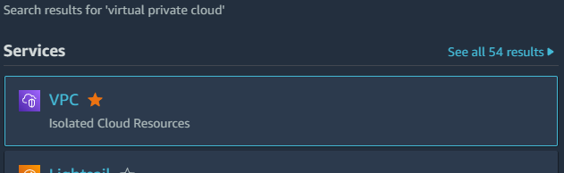
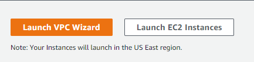
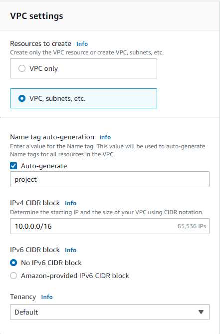
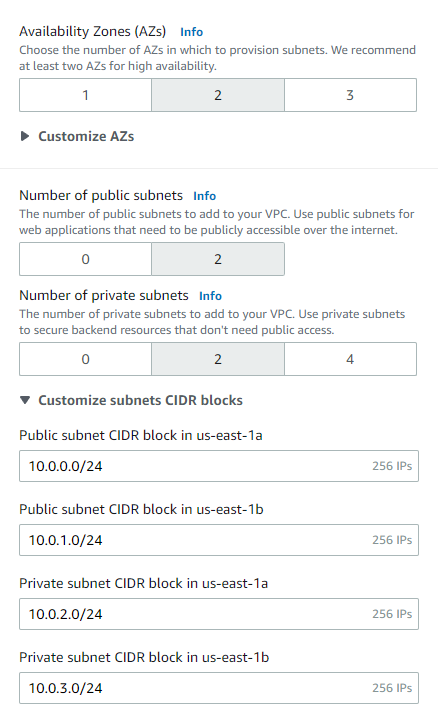
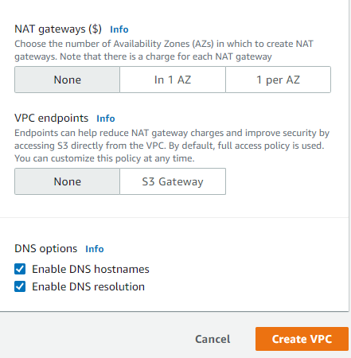
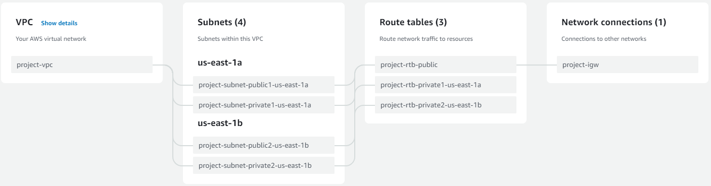
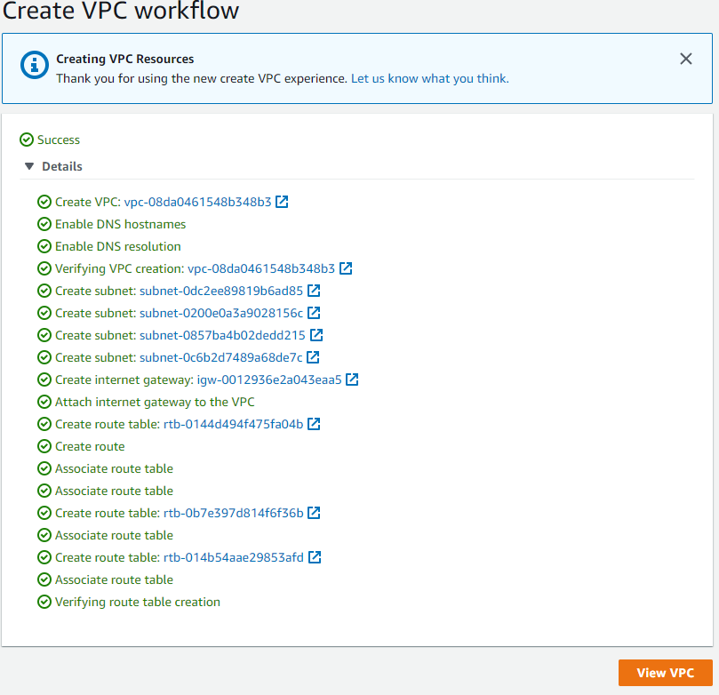
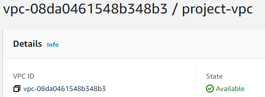
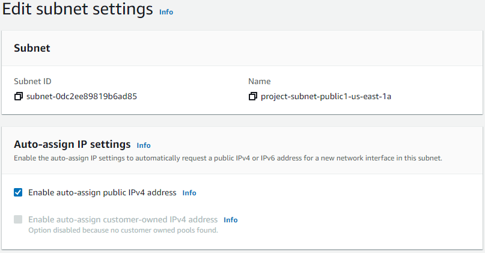
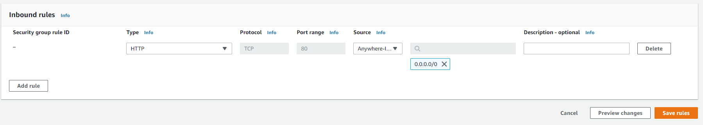

While learning about the various microservices that AWS provides to their clients, I noticed that many online tutorials seem to be outdated. Most content creators go through the process of creating VPCs or EC2 instances using the Old Experience rather than the New Experience. Even the tutorial whitepapers published by Amazon themselves seem to deal with the Old Experience. So, I thought that I would try my hand at writing a tutorial using the New Experience.

In this episode, I will be going through how to create a Virtual Private Cloud (VPC) with two public subnets and two private subnets in two different availability zones. I will also be going through the process of making the exact same VPC configuration using the AWS Command Line Interface (CLI).

First, log into your AWS Management Console. Access the Virtual Private Cloud (VPC) console. You can do this by searching for "virtual private cloud" into the search bar.

Once inside the console, launch the VPC wizard by clicking on the appropriate button.

Let's configure the settings to create two public subnets and two private subnets within two different availability zones.

Give your VPC a recognizable name. The auto-generate feature will assign that name to all the VPC components. Set your IPv4 CIDR block to "10.0.0.0/16" and tenancy to default. Let's not create a IPv6 CIDR block.

We want to set availability zones (AZs) to two and number of public/private subnets to two. Set your subnet CIDR blocks as shown in the image.

For this example, we will not be creating NAT gateways or VPC endpoints. We want to have DNS hostnames and resolution enabled. Click "Create VPC" to spin up the required resources!

The "New VPC Experience" is nice as it visualizes the VPC and its components in a clean workflow. It shows where each of the subnets will reside and how they are connected to the route table, internet gateway, etc.

Once the console tells you that the VPC and its components have been succesfully created, click on the "View VPC" to inspect your creation.

Your VPC should now be available, but there are still some settings to fix. You can browse through your subnets by clicking on "Subnets" from your sidebar. Make sure that "Auto-assign public IPv4 address" is set to "Yes" for your public subnets. Click on the relevant subnets, click on the "Action" drop-down menus, and click on "Edit subnet settings". Enable auto-assign public IPv4 address. Click "Save" to return to your subnet configurations.

You can go through the rest of the VPC components to make sure they're properly configured. Your Route Tables should have the proper subnet associations, your internet gateways should be activated, and your Network ACLs should have the proper inbound/outbound rules. Let's reconfigure the default security group for the VPC so that EC2 instances launched in public subnets can be appropriately governed by it.

Navigate to the Security Group page through the sidebar and click on the default group created by the wizard for your VPC. Click on "Edit inbound rules". We want to access any potential EC2 instances we launch within this security group from the internet. Delete the pre-existing security group rule. Click on "Add rule". Set the type to "HTTP" and the source to "Anywhere-IPv4". Click "Save rules".

Stay tuned for the next episode where I will be going through VPC configuration through the AWS CLI.