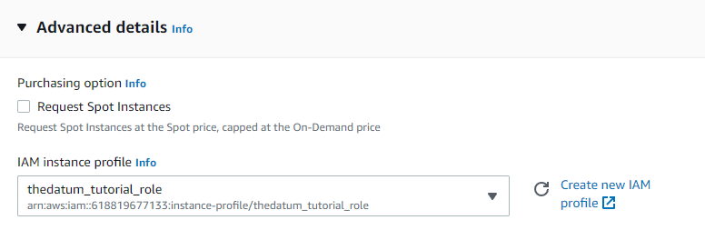
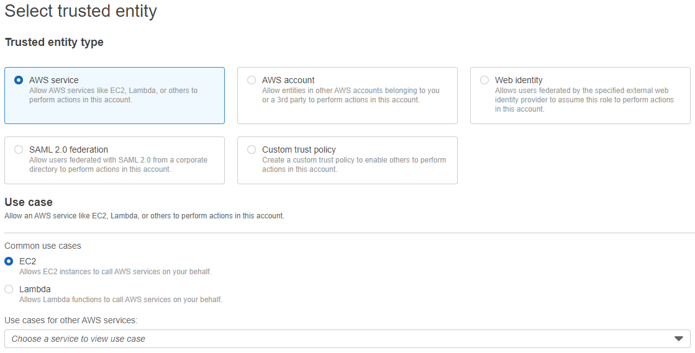

So, we have our VPC ready to go. Now we want to use that VPC for something useful. Why not install an Elastic Compute Cloud (EC2) instance and launch an Apache web server within that instance?

Take note that for this tutorial, I will be instructing you to connect to the EC2 instance through Amazon Systems Session Manager (SSM) rather than through a Secure Shell (SSH) client. I believe that SSM is more secure and reliable than SSH for a couple of valid reasons. Access to the SSM is managed through an instance role that can be controlled by the AWS account itself. The entire process is contained within AWS. On the other hand, access to the SSH client is managed through a machine-specific client that has to connect to AWS through a separate key. Moreover, you need to have access to the key to connect to the instance. If you lose the key or you are working on another machine that does not have access to the key, then you cannot connect to your instance. Meanwhile, all you need to connect to your instance through SSM is access to your AWS account. Feel free to let me know what you think regarding this comparison.

Let's continue on with the tutorial. First, access your AWS account and make sure you are in the region that you plan on launching your instance in. Navigate to the EC2 console.

Then, click on the Launch Wizard.

Let's set up the launch configuration. Name your instance something appropriate. Choose the Amazon Linux 2 AMI (Free Tier Eligible).

We want something light and non-intensive. A t2.micro instance will suit us just fine. Do NOT proceed with a key pair. We want to use the SSM to connect to our instance this time.

For our network settings, go ahead and select the VPC, subnet, and security group that we created during our VPC tutorial. The subnet should be public and should have auto-assign public IP enabled. The security group for our instance should allow HTTP access from anywhere on the internet.

Now, we want to create our Identity and Access Management (IAM) role that allows us to access our instance through SSM. Click on the "Create new IAM profile".

Choose "AWS service" and "EC2". Proceed to the next step.

Search for "ssm" in the search bar. Select "AmazonSSMManagedInstanceCore". Create the new IAM role. Ensure that this newly created role is selected for your EC2 instance.

Go to the summary sidebar. Review all your settings one more time. Launch your new EC2 instance.

Once you've successfully launched your EC2 instance, you should be forwarded to a confirmation page.

It takes a couple of minutes to boot the instance. Once the status of the instance states "Running", click on the instance ID to enter its detailed page.

Now, let's connect to the instance to install an Apache web server. Click on the "Connect" button at the top-right corner. Make sure that the "Session Manager" tab is selected before connecting.

Let's update our modules on our Linux instance.

> sudo yum update -y

Install the Apache web server.

> sudo yum install -y httpd

Start the web server.

> sudo systemctl start httpd

Ensure that the web server starts with each system boot.

> sudo systemctl enable httpd

Let's check out our Apache web server! Go back to your instance summary. Copy the public IPv4 address or DNS. Paste that into a new tab. The address should direct to the Apache test page. This means that you have successfully launched an EC2 instance within a VPC and installed an Apache web server.

To delete this instance, click on the "Instance state" drop-down menu at the top-right corner of the instance summary. Select "Stop instance". Once the instance status states "Stopped", click on the drop-down menu again and select "Terminate instance".